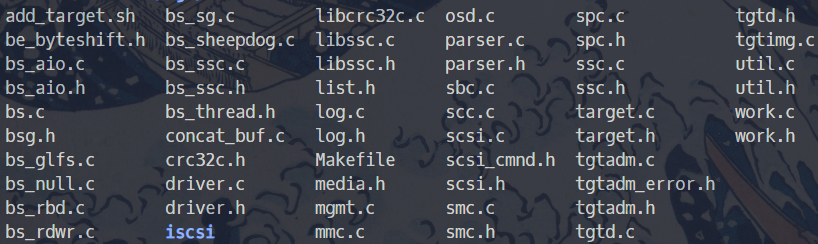

# 11月份の工作小结

事实证明，太忙和太冷就什么都不想做🥶🥶，回到家就只想蜷缩在底下铺着电热毯的温暖的被窝当中去。随着这操蛋的天气又开始转热了，今天甚至最高温度有20°C。浮躁的心就又开始按耐不住，开始记录一些篇章。notion导入好了，写把notion写了，再来写写blog

太忙了，这段时间，终于有时间开始写了，转眼都要到11.30，月末了，博客拖了太久了！这次突然开始写是因为看到前任实习生又拿到上海一家二次元大厂的实习offer了，一下子就给我整焦虑了😰😰

想着还是加加油，努努力，把没做完的事情赶紧弄完，想点可以做的东西出来。

## 社会就像react

社会就像react一样，自己的state，和父母给的props，交给社会，社会就能绘制出一帧一帧我们的人生。作为一个组件，没有能力去更改父组件给的props，就只有多变变state，勤能补拙。